# Django-Vue-Admin

## 演示图✅

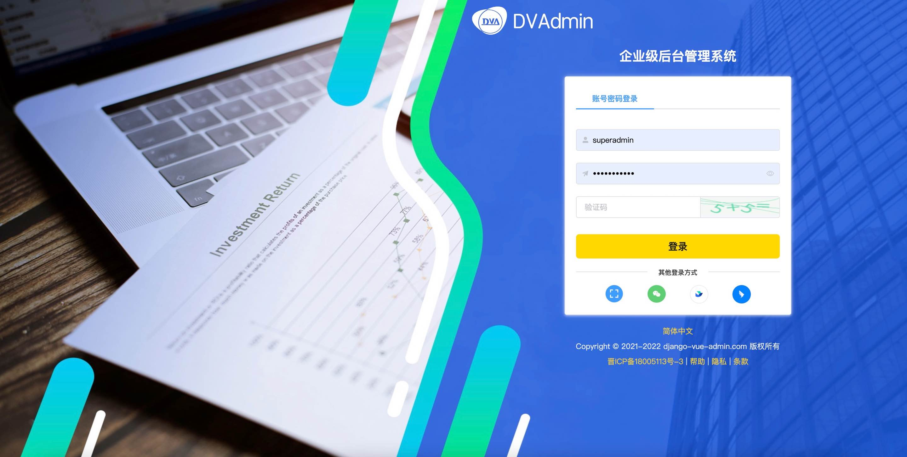

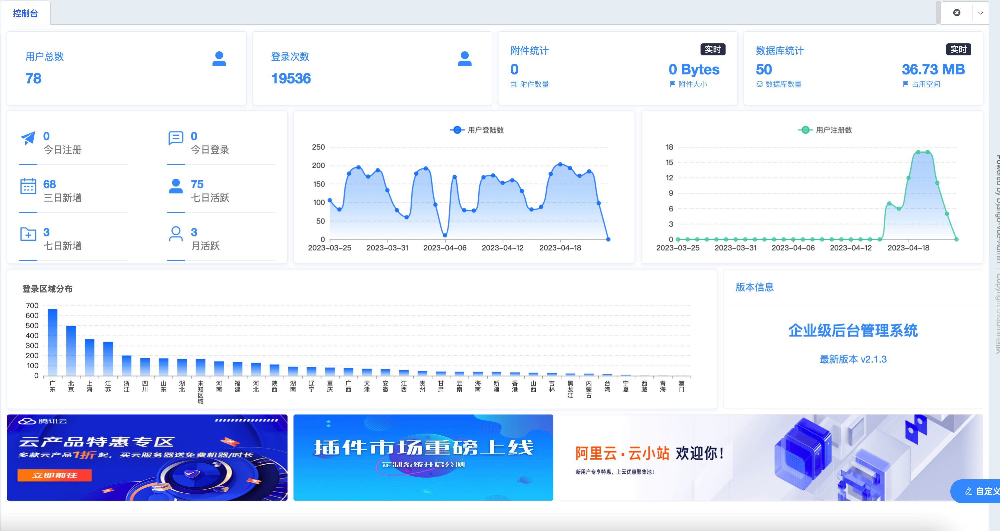

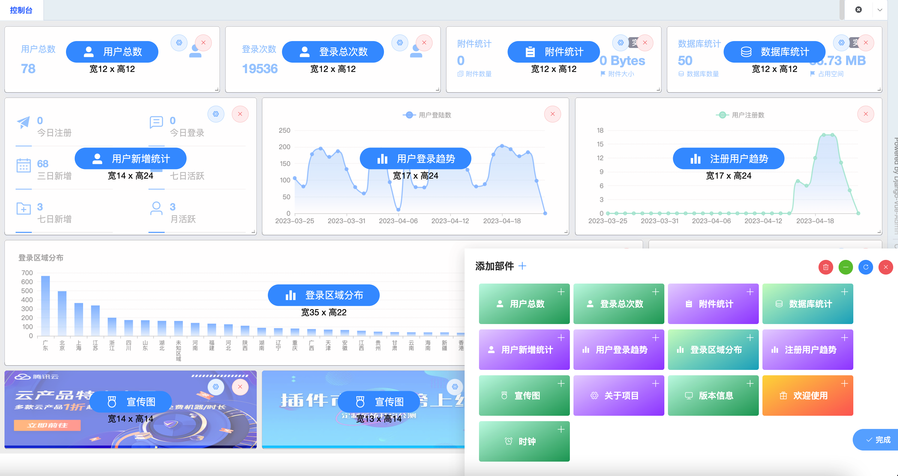

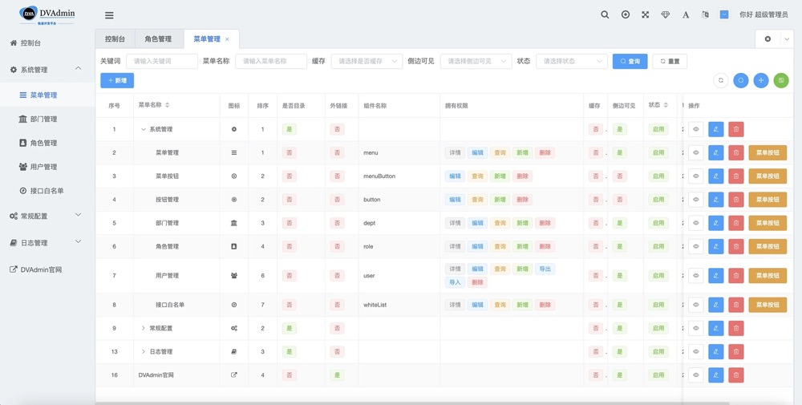

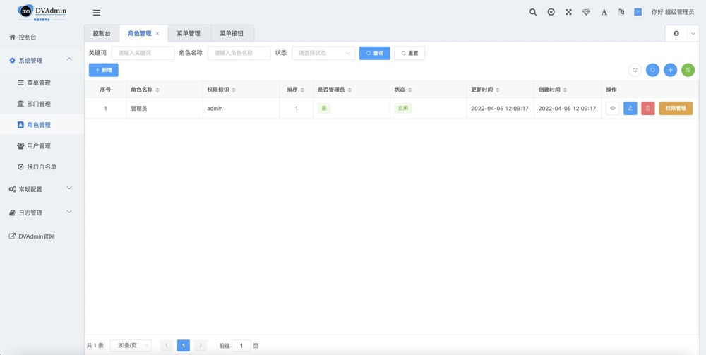

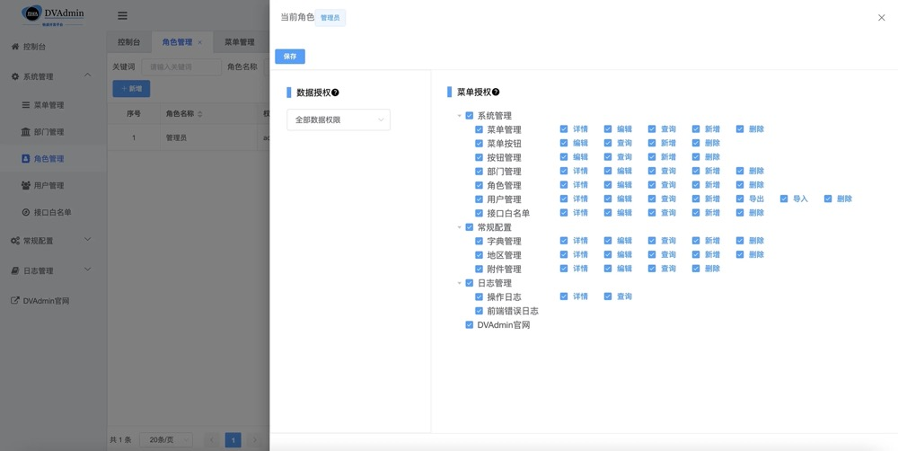

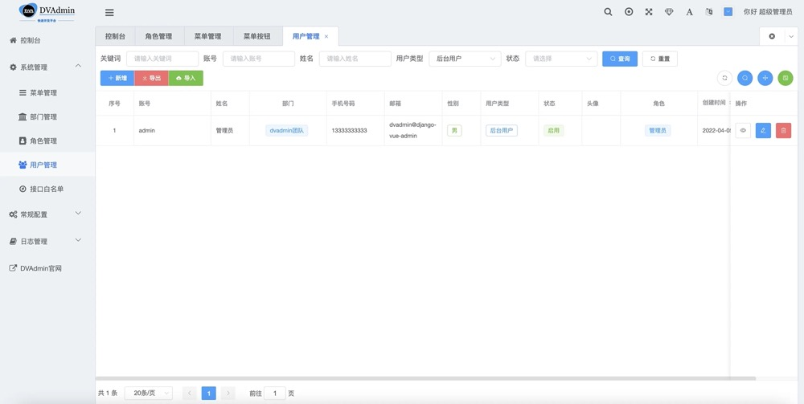

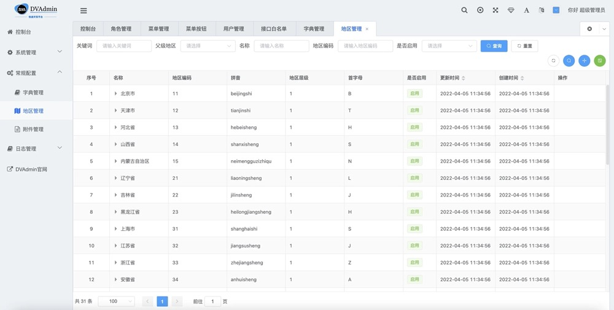

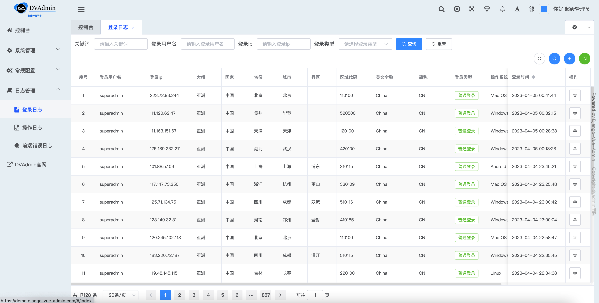

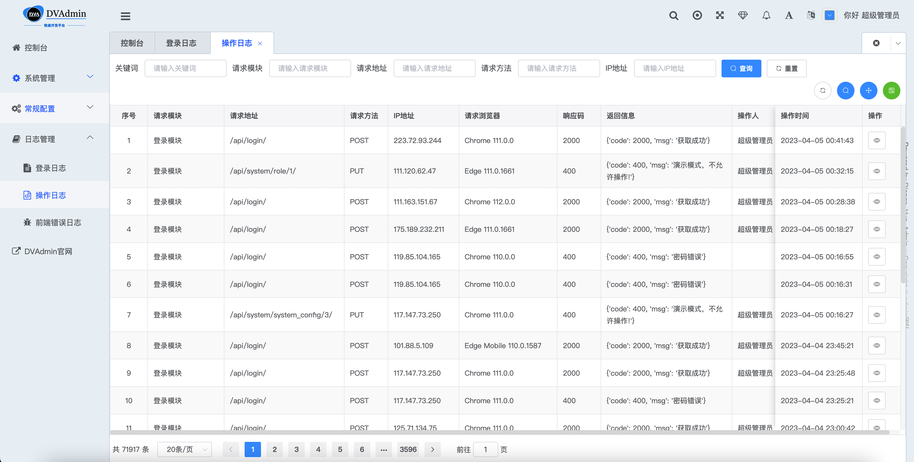

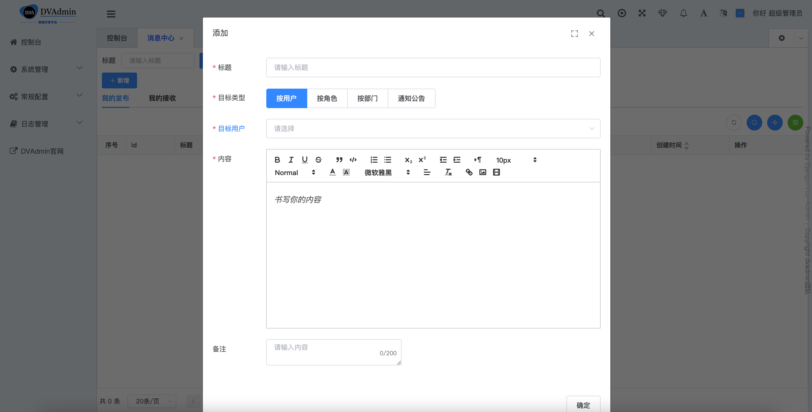

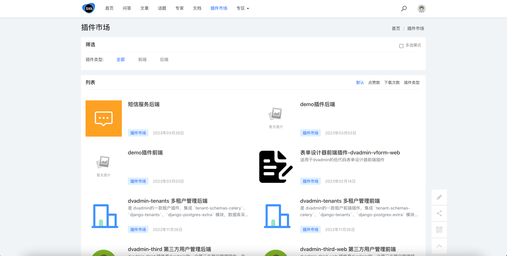

💡 **「关于」**

我们是一群热爱代码的青年，在这个炙热的时代下，我们希望静下心来通过Code带来一点我们的色彩和颜色。

因为热爱，所以拥抱未来

## 平台简介

💡 [django-vue-admin](https://gitee.com/dvadmin/django-vue-admin) 是一套全部开源的快速开发平台，毫无保留给个人及企业免费使用。

* 🧑‍🤝‍🧑前端采用[D2Admin](https://github.com/d2-projects/d2-admin) 、[Vue](https://cn.vuejs.org/)、[ElementUI](https://element.eleme.cn/)。
* 👭后端采用 Python 语言 Django 框架以及强大的 [Django REST Framework](https://pypi.org/project/djangorestframework)。
* 👫权限认证使用[Django REST Framework SimpleJWT](https://pypi.org/project/djangorestframework-simplejwt)，支持多终端认证系统。
* 👬支持加载动态权限菜单，多方式轻松权限控制。
* 💏特别鸣谢：[D2Admin](https://github.com/d2-projects/d2-admin) 、[Vue-Element-Admin](https://github.com/PanJiaChen/vue-element-admin)。
* 💡 特别感谢[jetbrains](https://www.jetbrains.com/) 为本开源项目提供免费的 IntelliJ IDEA 授权。

## 内置功能

1.  👨‍⚕️菜单管理：配置系统菜单，操作权限，按钮权限标识、后端接口权限等。
2.  🧑‍⚕️部门管理：配置系统组织机构（公司、部门、角色）。
3.  👩‍⚕️角色管理：角色菜单权限分配、数据权限分配、设置角色按部门进行数据范围权限划分。
4.  🧑‍🎓权限权限：授权角色的权限范围。
5.  👨‍🎓用户管理：用户是系统操作者，该功能主要完成系统用户配置。
6.  👬接口白名单：配置不需要进行权限校验的接口。
7.  🧑‍🔧字典管理：对系统中经常使用的一些较为固定的数据进行维护。
8.  🧑‍🔧地区管理：对省市县区域进行管理。
9.  📁附件管理：对平台上所有文件、图片等进行统一管理。
10.  🗓️操作日志：系统正常操作日志记录和查询；系统异常信息日志记录和查询。
11.  🔌[插件市场 ](https://bbs.django-vue-admin.com/plugMarket.html)：基于Django-Vue-Admin框架开发的应用和插件。


## 准备工作

~~~
Python >= 3.8.0 (推荐3.8+版本)
nodejs >= 14.0 (推荐最新)
Mysql >= 8.0
Redis(可选，最新版)
~~~

## 后端💈

~~~bash
1. 进入项目目录 cd backend
2. 在项目根目录中，复制 ./conf/env.example.py 文件为一份新的到 ./conf 文件夹下，并重命名为 env.py
3. 在 env.py 中配置数据库信息
	mysql数据库版本建议：8.0
	mysql数据库字符集：utf8mb4
4. 安装依赖环境
	pip3 install -r requirements.txt
5. 执行迁移命令：
	python3 manage.py makemigrations
	python3 manage.py migrate
6. 初始化数据
	python3 manage.py init
7. 初始化省市县数据:
	python3 manage.py init_area
8. 启动项目
	python3 manage.py runserver 0.0.0.0:8000
或使用 gunicorn :
  gunicorn -c gunicorn_conf.py application.asgi:application
~~~
## 前端♝

```bash

# 进入项目目录
cd web

# 安装依赖
npm install --registry= https://registry.npmmirror.com

# 启动服务
npm run dev
# 浏览器访问 http://localhost:8080
# .env.development 文件中可配置启动端口等参数
# 构建生产环境
# npm run build
```

### 访问项目

- 访问地址：[http://localhost:8080](http://localhost:8080) (默认为此地址，如有修改请按照配置文件)
- 账号：`superadmin` 密码：`admin123456`


